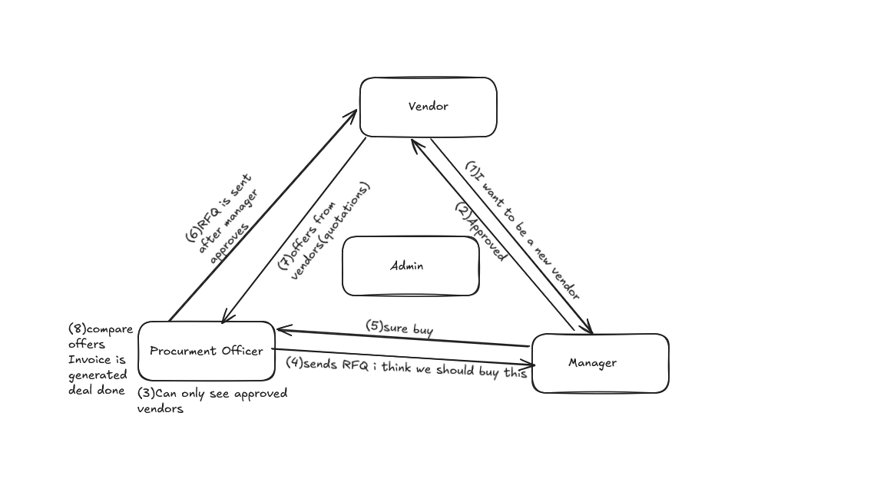

<a href="https://youtu.be/5q_gqYn2gos?si=tLPhraE4a06GyKJg" target="_blank">    
    
</a>

Click the above youtube link to see the demo!!!!

# VendorBridge - Procurement & Vendor Management ERP

VendorBridge is a full-stack procurement portal designed to manage the Request for Quote (RFQ) process, vendor bidding, purchase orders, and invoice reconciliation.

## Architecture

The project is structured into three main layers:
- **Frontend**: A single-page application built using HTML, CSS, and Vanilla JavaScript. Handles role-based dashboard rendering and API communication.
- **Backend**: A Python HTTP server (`http.server`) built with threading support to handle concurrent API requests.
- **Database**: SQLite database (`database/vendorbridge.db`) with tables representing users, vendors, RFQs, quotes, purchase orders, invoices, activities, and notifications. If the database file does not exist or is empty, it automatically seeds itself from `database/database.json`.

## Directory Structure

```text
Odoo Hackathon/
├── backend/
│   ├── .env               # SMTP and server configuration
│   └── server.py          # Web server and API endpoints
├── database/
│   ├── database.json      # JSON seed data and database backup file
│   ├── db.py              # SQLite DDL and seeding helper script
│   └── vendorbridge.db    # Relational SQLite database
├── frontend/
│   ├── index.html         # User interface layout
│   ├── app.js             # Client-side routing, state, and interaction handlers
│   └── style.css          # Application layout and typography styling
└── outbox/                # Outbox for emails saved locally as JSON when SMTP is offline
```

## Getting Started

### Prerequisites
- Python 3.x

### Running the Server
1. Open a terminal in the project root directory:
   ```powershell
   cd "c:\Users\Jainish Patel\Desktop\Odoo Hackathon"
   ```
2. Start the Python server:
   ```powershell
   python backend/server.py
   ```
3. Open a web browser and navigate to:
   `http://localhost:8000`

## Test Accounts

The dashboard includes a role selector for testing. The following accounts are pre-seeded in the database:

| Role | Name | Email | Password |
|---|---|---|---|
| Procurement Officer | Jainish Patel | officer@vendorbridge.com | password123 |
| Procurement Officer 2 | Arjun Mehta | officer2@vendorbridge.com | password123 |
| Manager / Approver | Vikram Malhotra | approver.manager@vendorbridge.com | password123 |
| Manager / Approver 2 | Ananya Iyer | manager2@vendorbridge.com | password123 |
| System Admin | System Admin | admin@vendorbridge.com | password123 |
| Vendor (Dhiraj Furniture) | Dhiraj Furniture Udyog | sales@dhirajfurniture.in | password123 |
| Vendor (Aarav IT) | Aarav IT Solutions | sales@aaravitsolutions.com | password123 |

## Features

- **Role-Based Views**: Dashboards tailored for Admins, Officers, Managers, and Vendors.
- **RFQ Bidding**: Officers create RFQs and invite vendors; vendors submit pricing and lead times.
- **Three-Way Invoice Matching**: Automatically flags mismatches between the RFQ, Purchase Order, and Vendor Invoice values.
- **SMTP Alerts with Outbox Fallback**: Sends email alerts when actions are completed. If SMTP settings in the `.env` file are invalid or missing, emails are saved locally inside the `outbox` directory.
